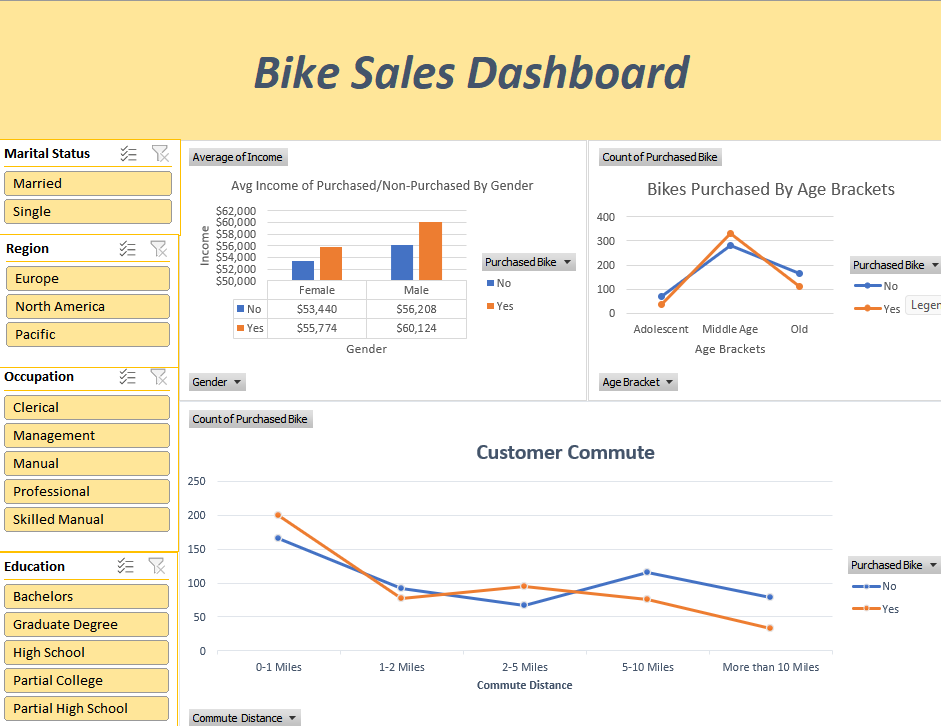

# Customer-Purchase-Behavior-Analysis

## Project Overview
This project analyzes a **Bike Buyers dataset** to understand the factors that influence customers' decisions to purchase bikes. Using **Microsoft Excel**, the dataset was cleaned, transformed, and analyzed to identify patterns in customer demographics and purchasing behavior.

An **interactive dashboard** was created to visualize key insights, allowing users to explore relationships between income, age, commute distance, and bike purchase decisions.

---

## Objectives
- Analyze customer demographic data to identify bike purchasing trends
- Understand factors influencing bike purchase decisions
- Create visual dashboards for easy data interpretation
- Demonstrate Excel-based data analysis and visualization skills

---

## Dataset
The dataset includes customer attributes such as:

- Age
- Gender
- Income
- Marital Status
- Occupation
- Education
- Commute Distance
- Region
- Bike Purchase (Yes/No)

---

## Tools Used
- **Microsoft Excel** (Pivot Tables, If Function, Charts)

---

## Project Workflow

### 1. Data Cleaning
- Removed duplicate records
- Corrected inconsistent values
- Organized categorical data for easier analysis

### 2. Data Transformation
- Created additional fields such as **Age Brackets**
- Structured the dataset for pivot table analysis

### 3. Data Analysis
Pivot tables were used to analyze:
- Bike purchases by **income level**
- Bike purchases by **age brackets**
- Bike purchases by **commute distance**

### 4. Dashboard Creation
An **interactive dashboard** was developed using Excel charts and filters to present insights visually.

---

## Key Insights
- Customers with **higher income levels** showed a greater likelihood of purchasing bikes.
- Certain **age groups demonstrated higher purchase rates** (Middle Age).
- **Commute distance** influenced the probability of buying a bike.
- Demographic factors like **marital status and occupation** revealed noticeable trends.

